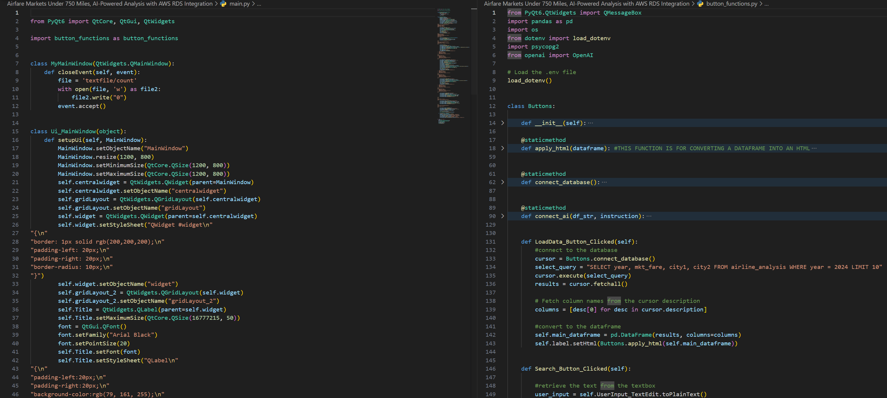
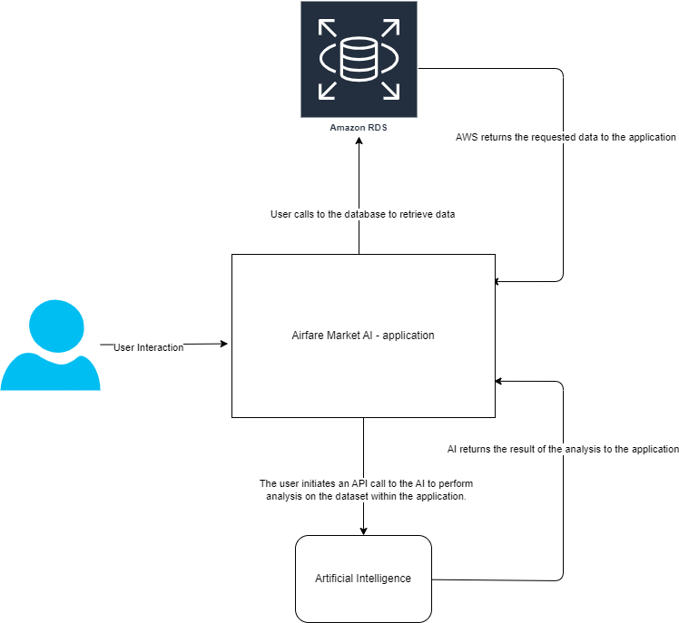
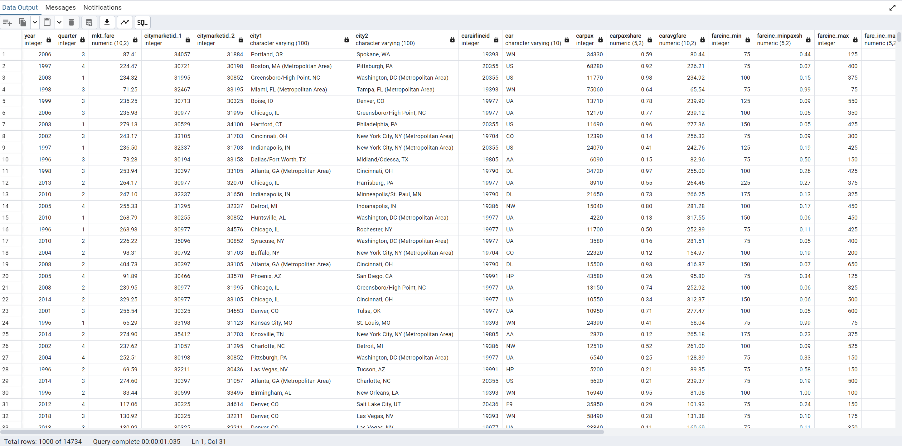

## Title: Airfare Markets Under 750 Miles, AI-Powered Analysis with AWS RDS Integration

## Program by: John Rivero

## Date: Octobr 25, 2024

## Description

-   Airfare Markets Under 750 Miles: AI-Powered Analysis with AWS RDS Integration is an advanced data-driven application designed to analyze airfare markets across short-haul routes (under 750 miles). This project integrates cutting-edge AI analytics with a robust backend powered by Amazon RDS PostgreSQL, allowing for seamless data retrieval and complex analytical processes.

    The application fetches real-time and historical airfare data stored in an Amazon RDS PostgreSQL database and utilizes AI algorithms to uncover key market trends, pricing behaviors, and other important insights. By leveraging AI, the application provides predictive analytics and generates actionable insights for users, such as identifying optimal flight booking times or detecting price fluctuation patterns across various airline carriers and routes.

    The integration of AWS RDS ensures secure, scalable, and efficient data management, allowing the application to handle large datasets and perform analytics in real-time. With its user-friendly interface, this application empowers users—from travel enthusiasts to industry analysts—to explore airfare trends within short-haul markets and make informed decisions based on data-driven insights.

    Designed to streamline airfare analysis, this application represents a powerful fusion of AI and cloud database technologies, offering an intuitive and informative experience for users seeking to understand the intricacies of airfare markets within 750-mile routes.

## Codebase
-   Below is an image of the code.

## Achitecture Diagram
- Below  is a diagram illustrating the architecture of the application.

## Amazon RDS 
-   Below is an image of the database.

## Result
-   Below is a video of the application.

