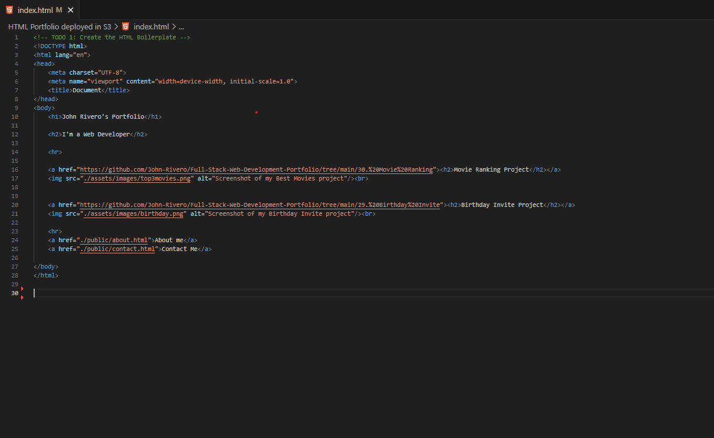
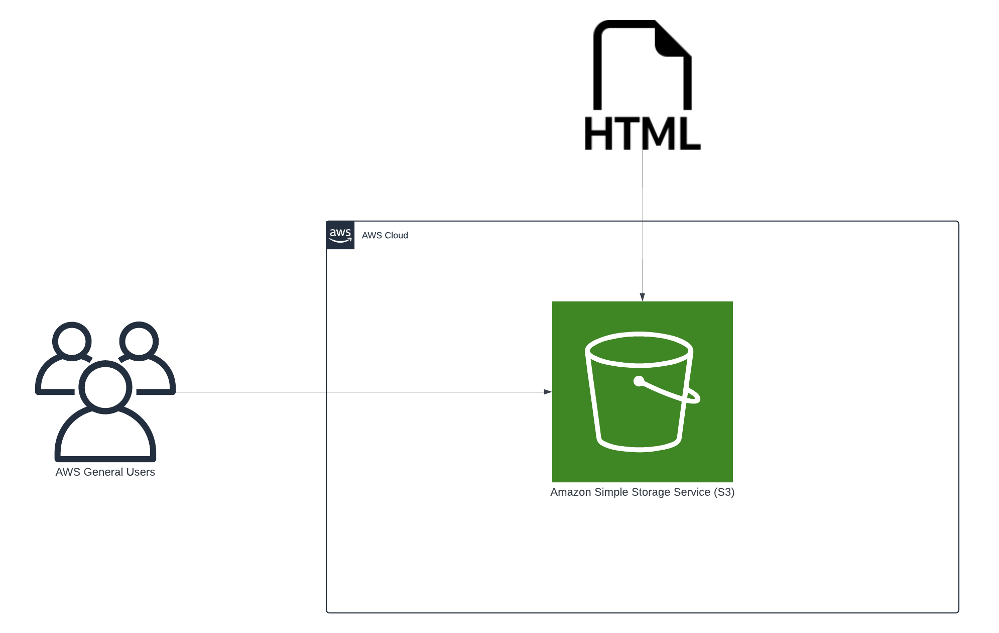
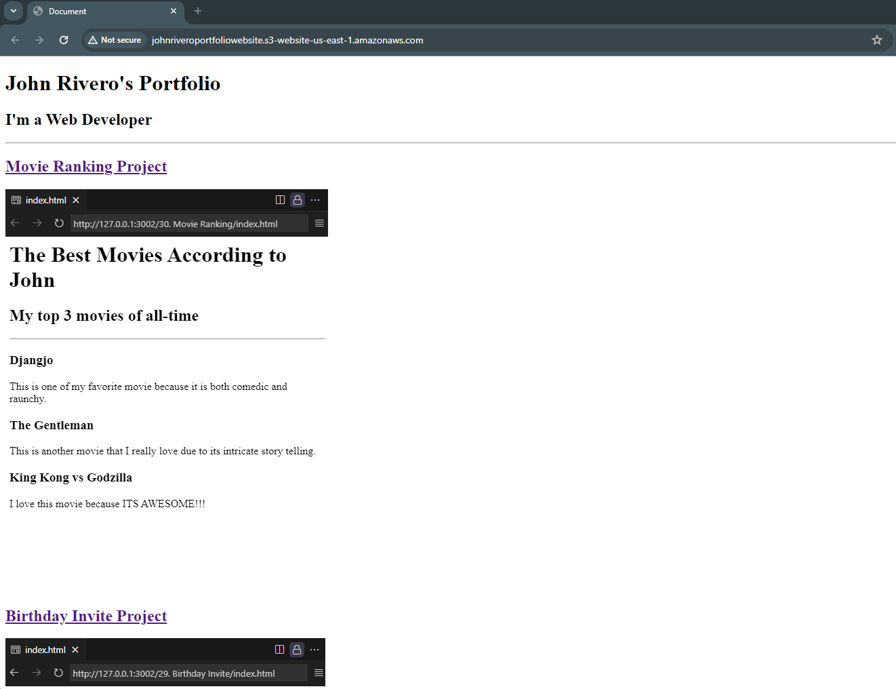

## Title: Online Portfolio Hosted on S3 for Static Website

## Program by: John Rivero

## Date: June 13, 2024

## Task

-   The purpose of this project is to develop a comprehensive online portfolio that features multiple pages dedicated to showcasing various projects. Each project page will include detailed descriptions, images, and any relevant media to provide a thorough overview of the work. Additionally, the portfolio will include hyperlinks to other relevant websites, such as GitHub repositories, live project demos, and professional profiles, offering visitors easy access to further details and resources. This online portfolio is currently deployed on Amazon S3 as a static website, ensuring high availability, scalability, and security. The use of Amazon S3 allows for seamless integration with other AWS services, facilitating efficient management and updates to the portfolio.

## Code
-   Below is an image of the code.

## AWS Achitecture Diagram
- Below  is a diagram illustrating the architecture of the application.

## Result
-   Below is the link for the website.
(http://johnriveroportfoliowebsite.s3-website-us-east-1.amazonaws.com/)

