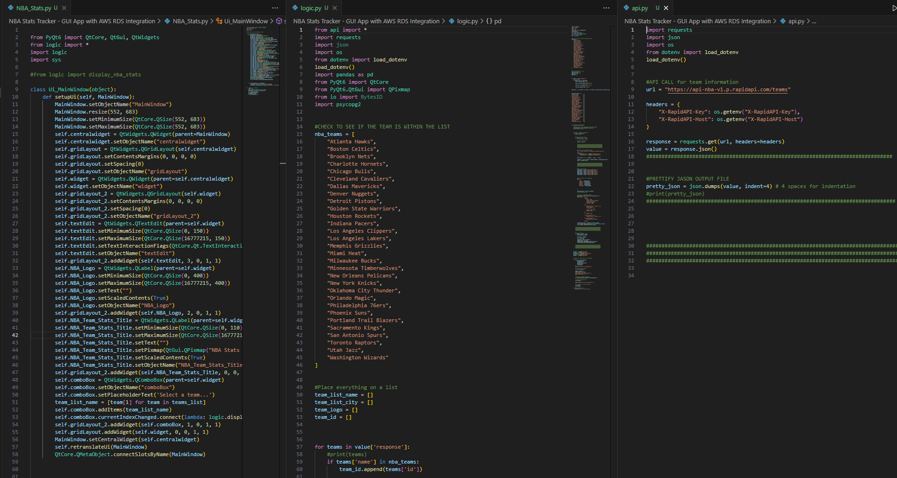
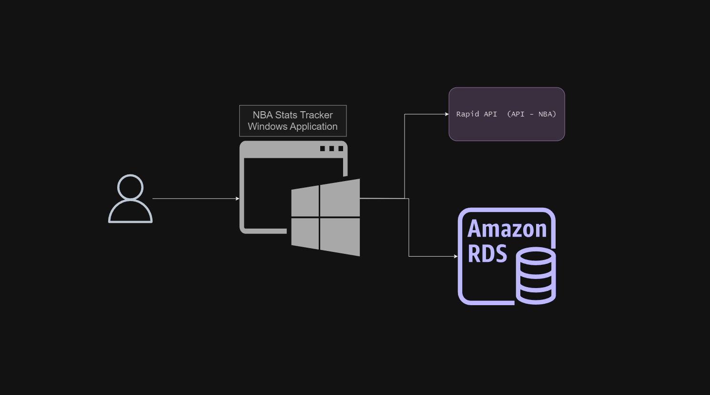
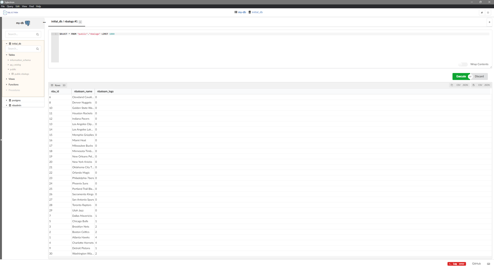
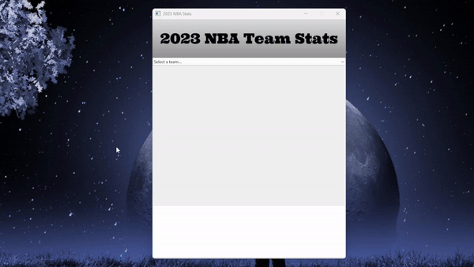

## Title: NBA Stats Tracker - GUI App with AWS RDS Integration

## Program by: John Rivero

## Date: February 25, 2024

## Description

NBA Stats Tracker is an intuitive and easy-to-use application that offers basketball fans a comprehensive view of NBA team statistics throughout the 2023 season. By leveraging the capabilities of Rapid API's NBA API, the app ensures that users have access to the latest team performances, including scores, player statistics, and much more. In addition to statistical data, the application enriches the user experience by displaying each team's logo, making it easy for fans to identify their favorite teams at a glance.

Built with efficiency in mind, NBA Stats Tracker utilizes Amazon's Reliable Database Service (Amazon RDS) to manage its backend operations. This cloud-based database solution allows for the secure storage and retrieval of app data, ensuring that the application runs smoothly and reliably for its users. A key feature of the app is its ability to monitor and record user interactions. Every time a team is selected or viewed within the app, this activity is logged into the database. This functionality not only provides insights into the popularity of certain teams but also helps in understanding user engagement levels.

Designed for both casual and avid NBA fans, NBA Stats Tracker aims to be the go-to source for up-to-date basketball statistics. With its user-friendly interface and robust backend infrastructure, the app promises a seamless and informative experience for anyone looking to stay connected with the fast-paced world of NBA basketball during the 2023 season

## Code

-   Below is an image of the code.

## AWS Achitecture Diagram

- Below  is a diagram illustrating the architecture of the application.

## Amazon RDS 

-   Below is an image of the database.

## Result

-   Below is a video of the application.

